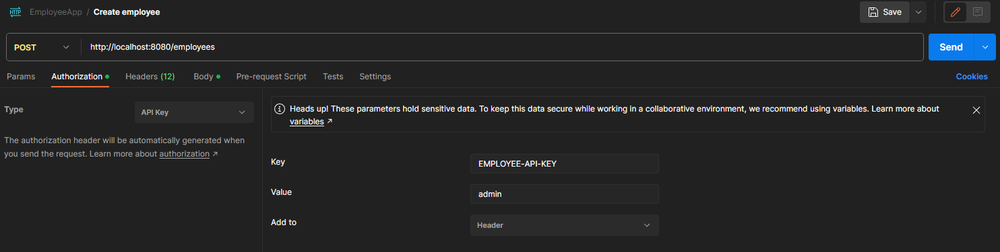
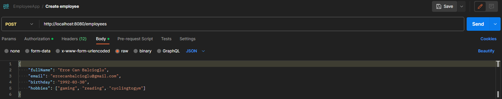

# Employee Service

The Employee Service is a small REST API-based service that manages employee
records. It allows you to create, retrieve, update, and delete employee 
information. 

The service also uses Kafka for event handling.

## Table of Contents

- [Getting Started](#getting-started)
    - [Prerequisites](#prerequisites)
    - [Installation](#installation)
- [Usage](#usage)
- [Testing](#testing)

## Getting Started

### Prerequisites

- Java Development Kit (JDK) 11 or higher
- Apache Maven (for building and managing dependencies)
- Docker (for running MongoDB and Kafka in containers)

### Installation

1. Clone this repository
2. Run  ` mvnw clean package -DskipTests ` to create a package to run 
in a docker container
3. Run `docker-compose up --build` to start a docker container composing
the Employee Service package, MongoDB instance and Apache Kafka

The project should be up and running.
Can be reached at:
http://localhost:8080

### Usage

#### Swagger is used to describe the structure of the APIs
http://localhost:8080/swagger-ui/index.html

There is authentication to access create, update and delete endpoints

```sh 
Key = EMPLOYEE-API-KEY
Value = admin
```


Example in Postman:



Example request body:



### Testing
To run the tests `mvnw test`